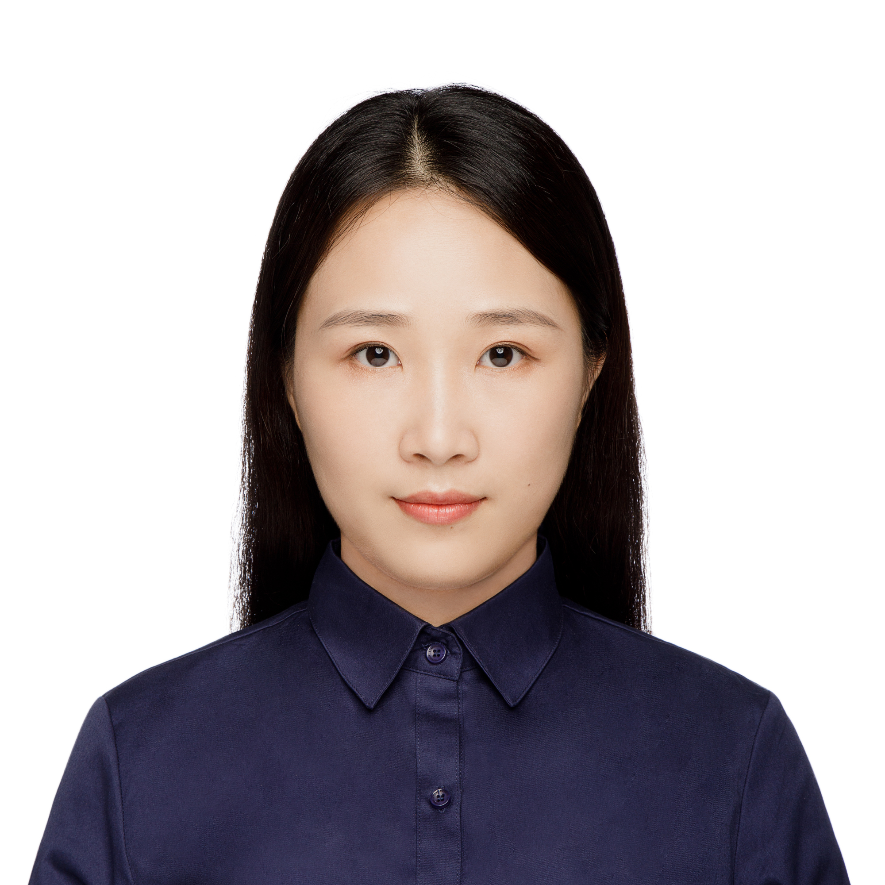

## Mengxi Jiang （江梦茜）
Xiamen University, China.
<table border="0">
  <tr>
    <td width="75%">
      
<b>About Me</b>

      
<b>I am currently a second year Ph.D student in computing science and technology at Xiamen University. My research interests are in machine learning and computer vision, especially in 3D geometry with the hybrid of learning-based and model-based methods.</b>
    </td>
    <td width="35%">
        
    </td>
  </tr>
</table>

## Publications
\item Mengxi Jiang, ZhuliangYu, Yan Zhang, Qicong Wanga, Cuihua Li, Yunqi Lei*. Reweighted sparse representation with residual compensation for 3D human pose estimation from a single RGB image. Neurocomputing. 2019. 9(358): 332-343. 
